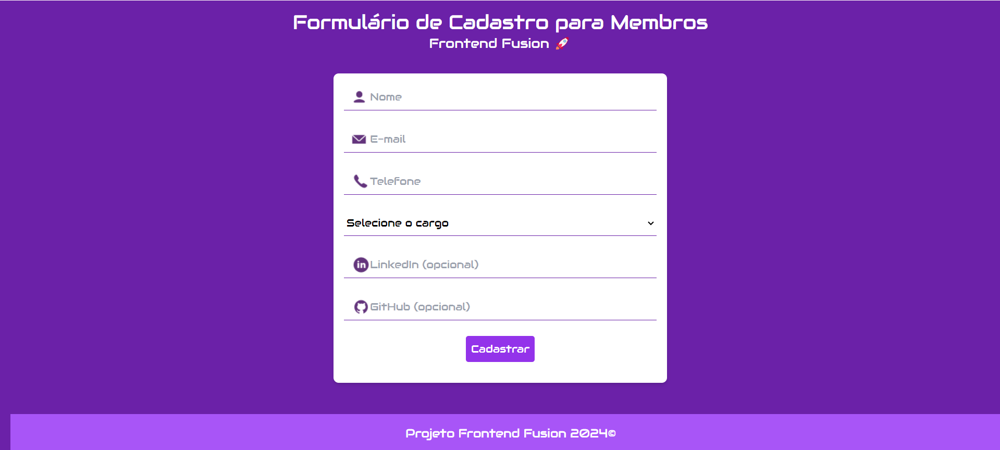

# Cadastro de Membros - Projeto Frontend Fusion 🚀

## Descrição do Projeto

Este projeto tem como objetivo desenvolver um formulário de cadastro de membros para o **Frontend Fusion**, utilizando **React**, **Tailwind CSS** e **Yup** para validação de dados. Este projeto faz parte do **Desafio 3**, que visa avaliar meus conhecimentos nas tecnologias mencionadas.

## Tecnologias Utilizadas

- **React**: Biblioteca JavaScript para a construção de interfaces de usuário.
- **Tailwind CSS**: Framework CSS que facilita o design responsivo e estilizado de forma rápida e eficiente.
- **Yup**: Biblioteca de validação de esquema que permite validar facilmente os dados de entrada.

## Funcionalidades

- Formulário de cadastro responsivo para novos membros.
- Validação de campos de entrada (nome, email, telefone, etc.) utilizando Yup.
- Feedback visual em tempo real para entradas inválidas.
- Botão de envio que processa e exibe uma mensagem de sucesso ao completar o cadastro.

## Motivação para o Uso do Yup

A escolha do Yup para validação de dados foi motivada por várias razões:

1. **Sintaxe Intuitiva**: Yup possui uma sintaxe clara e concisa que facilita a definição de esquemas de validação.
2. **Validação Assíncrona**: Suporta validações assíncronas, permitindo a verificação de campos que dependem de chamadas de API.
3. **Integração Simples**: O Yup se integra facilmente com formulários gerenciados por bibliotecas como Formik, tornando a implementação de validação mais simples e eficaz.
4. **Mensagens de Erro Personalizáveis**: Permite personalizar mensagens de erro, melhorando a experiência do usuário durante o preenchimento do formulário.

## Como Executar o Projeto

1. Clone este repositório:
   ```bash
   git clone https://github.com/seuusuario/desafio3.git
   ```
   
2. Navegue até o diretório do projeto:
   ```bash
   cd formulario-cadastro-membros
   ```

3. Instale as dependências:
   ```bash
   npm install
   ```

4. Execute o projeto:
   ```bash
   npm start
   ```

5. Abra seu navegador e acesse [http://localhost:3000](http://localhost:3000).

## Screenshots

